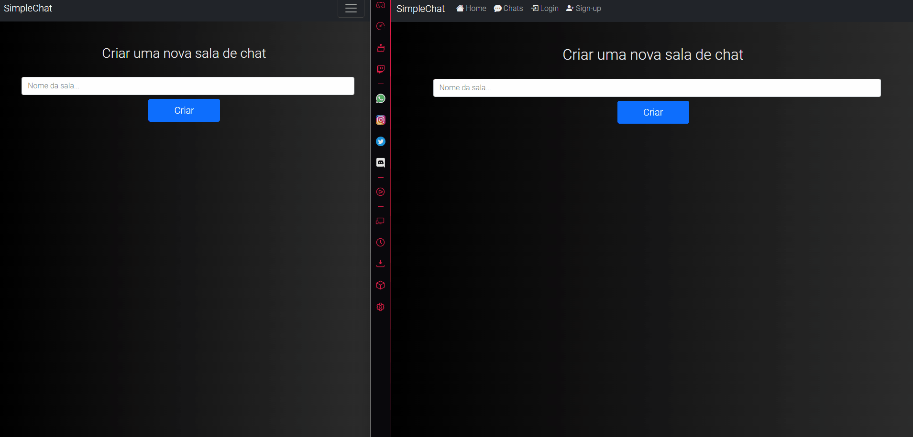

<h1 align='center'>SimpleChat</h1>
<p align='center'>Um simple webchat utilizando Django-Channels e Redis.</p>
<p><a href='http://simplechat-wick.herokuapp.com'>Clique aqui para ver a aplicação funcionando</a></p>

<p align='center'>
<a href='#feature'>Features</a> |
<a href='#pré-requisito'>Pré Requisitos</a> |
<a href='#pré-requisito'>Rodando a Aplicação</a> |
<a href='#pré-requisito'>Tecnologias</a> |
<a href='#pré-requisito'>Autor</a> |
</p>
<hr>
<br>
<a href='http://simplechat-wick.herokuapp.com'>

</a>
<br>
<br>
<hr>

 ## Feature

- [x] Sistema de cadastro de usuários
- [x] Criação de chats


## Pré-Requisito

Você precisar instalar em sua máquina as seguintes ferramentas: <a href='https://git-scm.com/'>Git</a>, <a href='https://www.python.org/'>Python</a>.

Você também vai precisar de um editor de codigo como o <a href='https://code.visualstudio.com/'>VSCode</a>

## Rodando a Aplicação
```bash
# Clone este repositório
$ git clone https://github.com/danielares/simple-chat
# Acesse a pasta do projeto no terminal/cmd
$ cd simplechat
# Instale as dependências
$ pip install -r requirements.txt
# Execute a aplicação
python manage.py runserver
#Acesse a aplicação no endereço http://127.0.0.1:8000/
```

## Tecnologias
As seguintes tecnologias abaixo foi usada na construção do projeto:

- <a href='https://www.python.org/'>Python</a>
- <a href='https://www.djangoproject.com/'>Django</a>
- <a href='https://channels.readthedocs.io/en/stable/'>Django Channels</a>
- <a href='https://redis.io'>Redis</a>
- <a href='https://getbootstrap.com/'>Bootstrap</a>

<hr>

## Autor
Made by Daniel Ares 👋
